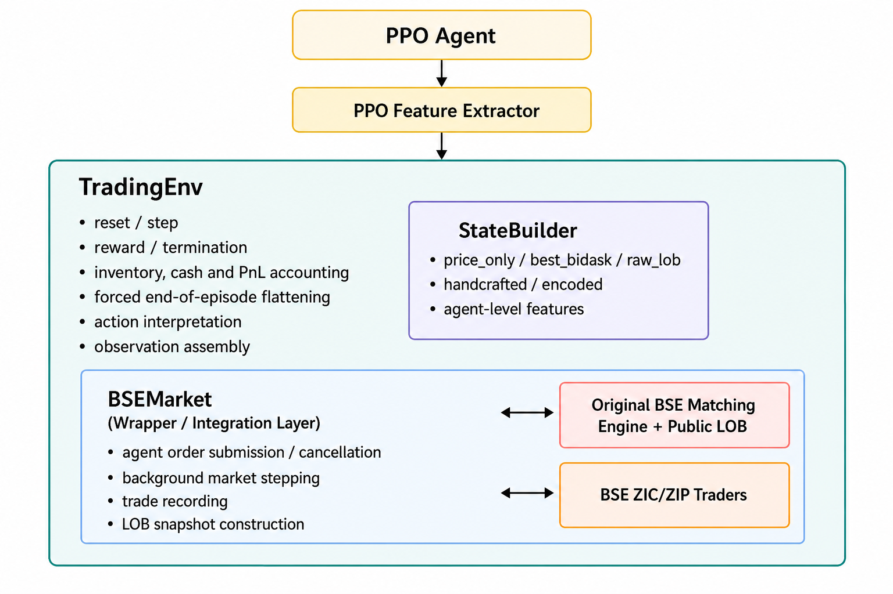

# Reinforcement Learning Order Book Trading Agent

**State Representation and Market Perception in a BSE Limit Order Book Environment**

## Overview

This project investigates how **market information and state representation affect the performance of reinforcement-learning trading agents** in a simulated limit order book.

A PPO-based agent trades through the original **Bristol Stock Exchange (BSE)** matching engine alongside ZIC and ZIP background traders. Five state representations are evaluated, ranging from price-only and best bid/ask information to raw LOB depth, handcrafted microstructure features, and learned LOB encodings.

The project focuses on whether richer market information necessarily improves trading performance, or whether appropriately structured representations allow the agent to use order-book information more effectively.

---

## Results

### Experiment 1 — Market Information Level

| State | Mean Total PnL | Sharpe |
|:--|--:|--:|
| Price Only | -312.15 | -0.09 |
| Best Bid/Ask | **15.80** | 0.01 |
| Raw LOB | -35.00 | 0.01 |

Best bid/ask significantly outperformed price-only observations in both total PnL (**p = 0.0053**) and Sharpe ratio (**p = 0.0061**), while deeper raw LOB information did not provide a statistically significant improvement over top-of-book information.

### Experiment 2 — LOB Representation

The **handcrafted microstructure representation** achieved the highest mean Total PnL (**270.02**) and Sharpe ratio (**0.12**).

It significantly outperformed all three learned encoder representations in Total PnL:

- MLP encoder: **p = 0.0010**
- CNN encoder: **p = 0.0002**
- Autoencoder: **p = 0.0005**

The advantage over best bid/ask was larger in mean PnL but was not statistically significant in this experiment (**p = 0.0745**).

### Experiment 3 — Policy-Level Validation

Under a denser and longer simulated market regime:

| Agent | Mean Total PnL | Sharpe |
|:--|--:|--:|
| PPO — Handcrafted | **762.40** | **0.34** |
| PPO — Best Bid/Ask | 455.70 | 0.19 |
| Random Quoting | -37.48 | -0.04 |
| Adaptive Quoting | -90.31 | -0.09 |
| Rule-Based | 0.16 | 0.00 |

The handcrafted PPO agent achieved approximately **67% higher mean PnL** than the best-bid/ask PPO agent, with the paired difference statistically significant (**p = 0.0356**).

It also significantly outperformed all three non-learning baselines in Total PnL (**p < 0.0001**).

---

## Experimental Design

The PPO agent uses five discrete actions:

- Hold
- Limit Buy
- Limit Sell
- Market Buy
- Market Sell

Five market-state representations are evaluated:

- `price_only` — recent prices, returns, and volatility
- `best_bidask` — top-of-book quotes, spread, and mid-price
- `raw_lob` — multi-level bid/ask prices and quantities
- `handcrafted` — engineered microstructure features such as spread, imbalance, depth, volatility, and micro-price deviation
- `encoded` — learned LOB representations using MLP, CNN, or autoencoder encoders

Every state also includes inventory, current PnL, and remaining episode time.

The reward is centred on changes in mark-to-market PnL, with shaping terms for inventory exposure, transaction costs, inactivity, drawdown, recent PnL volatility, and trading activity.

---

## Attribution and Implementation Overview

The file `market/BSE.py` is based on Dave Cliff's Bristol Stock Exchange (BSE) simulator.

The surrounding integration code, including `bse_market.py`, `trading_env.py`, state representations, experiment scripts and evaluation utilities, was developed for this project.

BSE repository: https://github.com/davecliff/BristolStockExchange

The figure below summarises how the original BSE components are integrated into this project. The original BSE matching engine, public LOB and ZIC/ZIP background traders are used through the `BSEMarket` wrapper. The reinforcement-learning interface, state construction, reward calculation, accounting logic, PPO integration and experiment code are implemented around this BSE layer.



---

## Installation

```bash
pip install -r requirements.txt
```

**Requirements:** Python ≥ 3.10, PyTorch, Stable-Baselines3, Gymnasium, NumPy, Matplotlib, SciPy

---

## Usage

### Run all three experiments
```bash
python main.py --all
```

Some formal experiment scripts override the default training budget and may use larger PPO training budgets, depending on the experiment configuration.

### Run a single experiment
```bash
python main.py --exp 1     # Information level comparison
python main.py --exp 2     # Representation method comparison
python main.py --exp 3     # PPO agents vs non-learning baselines
```

### Custom settings and quick checks

The experiment scripts support custom run counts, training steps and evaluation episodes. For example, to run all experiments with custom settings:

```bash
python main.py --all --n_runs 5 --n_steps 500000 --n_eval 50
```

For a quick code-structure check, use a much smaller setting:

```bash
python main.py --exp 1 --n_runs 1 --n_steps 10000 --n_eval 5
```

Experiment 3 can also be run with a specific PPO state representation:

```bash
python main.py --exp 3 --best_state_type handcrafted
```

`Experiment 3` currently supports only `handcrafted`, `best_bidask`, or the default `both`.

The full formal experiments can take a long time because each configuration is trained over multiple independent runs. The reported experimental results were generated using the formal experiment settings described in the report.

### Representative saved model

The submitted outputs include a representative trained `RL(handcrafted)` model from Experiment 3 using seed `42`:

- `outputs/experiment3/models/rl_handcrafted_seed42.zip`
- `outputs/experiment3/models/rl_handcrafted_seed42.txt`

These files are provided as example saved model outputs. The formal experimental results reported in the report are based on the multi-run evaluation procedure, not on this single representative model alone.

---

## Outputs

Each experiment writes figures and a plain-text summary into its own directory:

- `outputs/experiment1/`
- `outputs/experiment2/`
- `outputs/experiment3/`

Experiment 3 model outputs may also include:

- `outputs/experiment3/models/rl_handcrafted_seed42.zip`
- `outputs/experiment3/models/rl_handcrafted_seed42.txt`

Typical files include:
- `lines_total_pnl.png`
- `lines_sharpe_ratio.png`
- `lines_max_drawdown.png`
- `significance_total_pnl.png` for Welch-based experiments
- `significance_total_pnl_paired.png` for paired-test experiment outputs
- `results.txt`

---

## Reproducibility Notes

The main configuration values are defined in `config.py`. Some experiment scripts override selected settings, such as training steps, episode length, market density, or evaluation episodes, to match the formal experiment settings used in the report.

All compared methods within the same experiment use the same environment dynamics, action space, reward structure, accounting rules, inventory limits and evaluation protocol.

---

## Limitations

- BSE is a controlled simulated market and does not model latency, hidden liquidity, institutional order flow, or multiple assets.
- Results should be interpreted within the simulated BSE environment rather than as evidence of real-market profitability.
- PPO training remains stochastic, and broader market regimes and larger numbers of seeds would strengthen robustness.